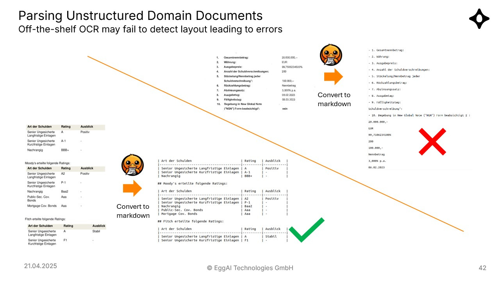
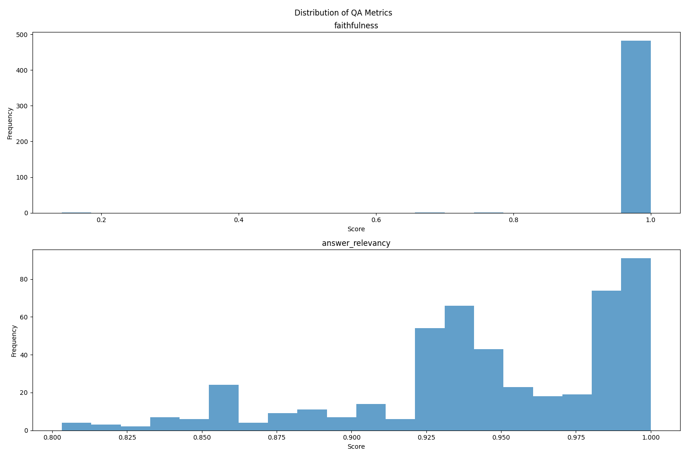
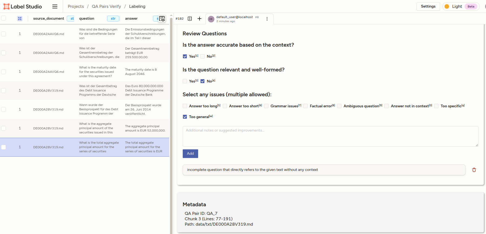

# QA Extraction with Human Review

Extracts QA pairs from documents with human review workflow via [Label Studio](https://github.com/HumanSignal/label-studio/). Includes source tracking and quality filtering for creating ground truth evaluation datasets.

## Features

- Extract QA pairs with source references (line numbers, chunks)
- Human review interface using Label Studio
- Quality filtering based on review scores
- Multiple export formats

## Prerequisites

- Python 3.10+
- An LLM provider API key (OpenAI, Anthropic, etc.) or local LLM (vLLM, Ollama)
- macOS/Linux (Windows users may need WSL)

## Quick Start

### 1. Clone and Setup

```bash
# Clone the repository
git clone git@github.com:eggai-tech/qa-extraction-with-human-review.git
cd qa-extraction-with-human-review

# Create and activate virtual environment
python3 -m venv venv
source venv/bin/activate  # On Windows: venv\Scripts\activate

# Install dependencies
make setup
```

### 2. Configure Your LLM Provider

Copy the example config and add your API key:

```bash
cp configs/config.example.yaml configs/config.yaml
```

Then edit `configs/config.yaml` and configure your API key:

```yaml
api-endpoint:
  api_key: "your-api-key-here"
```

### 3. Prepare Your Documents

Place your text documents in the `data/txt/` directory or alternatively if you have PDFs, place them in `data/pdf/` and run the conversion to markdown:

```bash
make convert-pdfs
```
We use [docling](https://github.com/docling-project/docling) library to convert PDFs to text files. The converted files will be saved in `data/txt/`.

### 4. Extract QA Pairs

```bash
make qa-pairs
```
This will process all the documents in `data/txt` and save the extracted QA pairs as json files in `data/extracted`

### 5. Filter QA Pairs based on Quality metrics

```bash
make filter-qa-pairs
```

This will filter the extracted QA pairs based on quality metrics [faithfulness, answer relevance, context accuracy](https://docs.ragas.io/en/v0.1.21/concepts/metrics/) and save the filtered pairs in `data/filtered`.


### 6. Verify the QA Pairs in Label Studio

As a final step, we can verify the QA pairs using human review via Label Studio. This allows us to ensure the quality of the extracted QA pairs.

```bash
# 1. Export QA pairs for review
make export-labelstudio

# 2. Start Label Studio
make start-labelstudio

# 3. In Label Studio (http://localhost:8080):
#    - Create project "QA Pairs Review"
#    - Import label_config.xml and qa_review_tasks.json
#    - Review QA pairs: for each question/answer/context answer two simple yes/no questions: "Is the answer accurate based on the context?", "Is the question relevant and well-formed?"
#    - Export the results after review: Export -> Choose 'JSON-MIN'

# 4. Process review results
make process-reviews EXPORT_FILE=path/to/export.json
```
After the last step of processing the reviews, the final QA pairs will be saved in `data/labelstudio/verified_results`.


## Commands

```bash
make setup              # Initial setup
make qa-pairs           # Extract QA pairs
make filter-qa-pairs    # Filter QA pairs based on quality
make export-labelstudio # Export for review
make start-labelstudio  # Start Label Studio
make process-reviews EXPORT_FILE=<file>  # Process results
```

## Configuration

Edit `configs/config.yaml` to customize:

```yaml
llm:
  provider: "api-endpoint"  # or "vllm", "ollama", etc.

api-endpoint:
  api_base: "https://api.openai.com/v1"
  api_key: "your-key-here"
  model: "gpt-4o-mini"  # Model depends on provider

extraction:
  temperature: 0.7
  chunk_size: 2000
  num_pairs: 5  # QA pairs per chunk
```

In order to add a custom prompt for the QA generation step (`make qa-pairs`), you can edit the `prompts` section in the config, e.g.:

```yaml
prompts:
  my_qa_generation: |
    Create {num_pairs} question-answer pairs from this text for LLM training.

    Rules:
    1. Questions must be about important facts in the text
    2. Answers must be directly supported by the text
    3. Return JSON format only:

    [
      {{
        "question": "Question 1?",
        "answer": "Answer 1."
      }},
      {{
        "question": "Question 2?",
        "answer": "Answer 2."
      }}
    ]

    Text:
    {chunk_text}
```
and then run:
```bash
python generate_qa.py --prompt my_qa_generation
```

## Troubleshooting

- **Label Studio won't start**: Try `venv/bin/label-studio start --port 8081`
- **LLM errors**: Check API key in `configs/config.yaml`
- **Large documents**: Reduce `chunk_size` in config


## Example Output

```json
{
    "question": "What is the total nominal amount of the tranche of securities issued by Erste Group Bank AG?",
    "answer": "The tranche of securities is issued in a total nominal amount of up to EUR 50.000.000.",
    "reference": {
      "chunk_id": 1,
      "char_start": 3800,
      "char_end": 7800,
      "line_start": 72,
      "line_end": 141,
      "chunk_preview": "Erste Group Bank AG (die \"Emittentin\") vom 28. Oktober 2020, und etwaigen  Nachträgen,  bzw.  einem ...",
      "source_document": "AT0000A2VDG3.txt"
    }
  }
```

## Creating a Question-Answer Benchmark
Let's create a sample question-answering benchmark to evaluate the RAG-based system performance on a given corpus.
We'll use a small subset of 10 documents from the [FinCorpus-DE10k](https://huggingface.co/datasets/anhaltai/fincorpus-de-10k) dataset.
The documents can be found in `data/pdf` directory.

We'll split the tasks into the following steps:
1. Convert the PDF documents to text files using.
2. Generate question-answer pairs from the text files.
3. Score the generated QA pairs based on quality metrics.
4. Verify the QA pairs using human review via Label Studio.

### 1. Convert PDF to Text
Some PDFs are scans of the original documents, so we need to use OCR capabilities to convert them to text.
Fortunately, the `docling` library provides a convenient way to do this. We convert the sample PDFs to markdown files
using the `make convert-pdfs` command.

Although it's doing a good job it's not free of errors, so for some files we need to manually review the generated text
files in `data/txt/` directory and fix any issues. 

Below are sample errors found in the generated markdown files: in the top-right table is parsed incorrectly, resulting
in a single column instead of two columns.




### 2. Generate Question-Answer Pairs
To generate question-answer pairs from the text files, we can use the `make qa-pairs` command.
To configure the chunking strategy and the number of QA pairs to generate per chunk, edit the `configs/config.yaml` file.
One can also configure the QA generation prompt in `configs/config.yaml` under the `prompts` section.
If we use the generic prompt, i.e.:
```
Create {num_pairs} question-answer pairs from this text for LLM training.

Rules:
1. Questions must be about important facts in the text
2. Answers must be directly supported by the text
3. Return JSON format only:
[
  {{
    "question": "Question 1?",
    "answer": "Answer 1."
  }},
  {{
    "question": "Question 2?",
    "answer": "Answer 2."
  }}
]

Text:
{chunk_text}
```
lots of QA pairs will be incomplete, meaning the questions are very specific to the information in the chunk
but lack context to be useful for a RAG-based system. Sample questions of this type are:
- What is the submission period for the securities as **specified in the text**? 
- What is the ISIN code for the securities **mentioned in the document**?
- What risks are associated with variable interest rate bonds **according to the text**?

We can see that the above questions do make sense, but they are too specific to the chunk and do not provide enough context.

To improve the QA generation, we can use a custom prompt, which apart from the chunk text also includes the document
summary in order to provide the necessary context for the questions. Here's the more optimized prompt:

```
    Generate high-quality question-answer pairs for LLM training.

    Document Summary:
    {summary}
    
    Use this summary to understand the document's overall context. However, generate all questions and answers strictly from the main text provided below.
    
    Focus Areas:
      - Financial instruments, especially bonds, equities, derivatives, etc.
      - Issuer details, ISINs, maturity dates, terms & conditions
      - Financial metrics, issuance volumes, and key legal or regulatory elements
    
    Avoid vague or overly general questions. Ensure each question is specific, fact-based, and clearly tied to the source text.

    Instructions:
      1. Create exactly {num_pairs} question-answer pairs.
      2. Questions must cover important facts from the text.
      3. Answers must be verifiable and explicitly supported by the text.
      4. Add context to each question based on the summary, such as company names, financial instruments, ISINs, etc.
      5. Questions and answers must be in the same language as the source text.
      6. Return JSON format only:
      [
        {{
          "question": "Question 1?",
          "answer": "Answer 1."
        }},
        {{
          "question": "Question 2?",
          "answer": "Answer 2."
        }}
      ]

    Text:
    {chunk_text}
```

On top of QA generation, we make one additional LLM call per document to generate a summary of the document.
Here are some examples of the generated question-answer pairs:
- Where can I find the prospectus for the bond with ISIN AT0000A268B3?
- What is the total amount of the Zero Coupon Notes issued by Deutsche Pfandbriefbank AG?
- Welchen Zinssatz haben die Schuldverschreibungen der Erste Group Bank?

The above questions are more complete, in the sense that they provide enough context to be useful for a RAG-based system.

### 3. Score/filter QA Pairs
To score and the generated QA pairs based on quality metrics, we can use the `make filter-qa-pairs` command.

In order to configure the scoring/filtering step edit the `filtering` section in the `configs/config.yaml` file:
```yaml
# Query filtering setting
filtering:
  deduplicate_threshold: 0.7                # Whether to deduplicate questions
  faithfulness_threshold: 0.6               # Minimum faithfulness threshold for question-answer pairs
  answer_relevancy_threshold: 0.7           # Minimum relevancy threshold for answers
  context_precision_threshold: 0.6          # Minimum precision threshold for context relevance
```

First of all, we use semantic deduplication to remove similar questions. To this end we use an embedding model
(Sentence Transformers) to compute the embeddings of the questions and then use cosine similarity to filter out similar questions.
If the cosine similarity between two questions is above the `deduplicate_threshold` (default 0.7), we keep only one of them.

After the semantic deduplication step, we score the question-answer pairs based on the following quality metrics:
- **Faithfulness**: Measures if the answer is supported by the text. The generated answer is regarded as faithful if all the claims made in the answer can be inferred from the given context. LLM is used to extract the claims from the answer and then check if they can be found in the context. IMPORTANT: if the document summary was included in the QA generation prompt, the context used for the faithfulness check will also include the summary. This is done to ensure that the answer is faithful to the overall document context, not just the chunk text.
- **Answer Relevancy**: Measures if the answer is relevant to the question. A lower score is assigned to answers that are incomplete or contain redundant information and higher scores indicate better relevancy. The Answer Relevancy is defined as the mean cosine similarity of the original question to a number of questions, which where generated (reverse engineered) by the LLM based on the answer.
- **Context Precision**: Context Precision is a metric that evaluates for a given question whether all the relevant items (i.e. our answer) are ranked higher than other answers (randomly selected from the extracted QA pairs). This is an indicator that the question is very specific and the answer can be easily distinguished from other answers.

We give the thresholds for the quality metrics in the `configs/config.yaml` file, and the QA pairs that  meet the thresholds are saved in the `data/generated/filtered` directory.
The QA paris that do not are below the thresholds are saved in the `data/generated/rejected` directory.

Below we show the distribution of the Faithfulness and Answer Relevancy for the QA extracted from our sample documents:


We can see that although most of the QA paris have almost perfect Faithfulness, i.e. the answers are supported by the context.
Similarly, most of the QA pairs have Answer Relevancy score above 0.8, meaning that the answers are relevant to the questions.

Let's examine some examples of the QA pairs generated from the sample documents:

```
"question": "What is the issue amount for the bonds issued by Erste Group Bank AG under its Debt Issuance Programme?",
"answer": "The issue amount for the bonds is up to EUR 50,000,000.",
```


```
"question": "What is the interest rate for the bonds issued by Erste Group Bank AG?",
"answer": "The interest rate is 1.40% per annum.",
```

However, we can also see a lot of QA pairs which are very similar to the 2nd example and have not been captured by our semantic deduplication step, e.g.
```
"question": "What is the interest rate for the bonds issued by Erste Group Bank AG under its Debt Issuance Programme?",
"answer": "The interest rate is 1.40% per annum."
```

```
"question": "What is the interest rate of the bonds issued by Erste Group Bank AG under its EUR 30 billion Debt Issuance Programme?",
"answer": "The interest rate is 1.40% per annum."
```

We can either increase the `deduplicate_threshold` in the `configs/config.yaml` file to filter out more similar questions, or we can manually review the QA pairs in the last verification step performed by a human annotator in Label Studio.

To conclude, the quality metrics are good proxies for the QA pairs quality. For the best quality it is recommended to manually review the QA pairs in the last step of the workflow.

### Verify the QA pairs in Label Studio.
In order to ensure the high quality of the extracted QA pairs, we can use human review via Label Studio.
To do this, we can use the `make export-labelstudio` + `make start-labelstudio` commands to export the QA pairs for review and start the Label Studio server.

Here's the example of the Label Studio interface for reviewing the QA pairs:



Here we simplify the task and ask the user only two questions:
1. Is the answer accurate based on the question and context? YES/NO
2. Is the question relevant to and well-formed? YES/NO

After the review is done we can export the results and save the final QA pairs using `make process-reviews` command.
This will save only the QA pairs that have been marked as "yes" for both questions in the `data/labelstudio/verified_results` directory.

## License

MIT

## Acknowledgments

- Uses [Label Studio](https://labelstud.io/) for human review interface
- Supports multiple LLM providers (OpenAI, Anthropic, local models)
